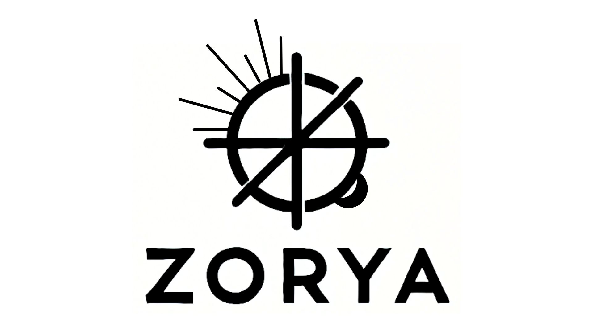

<div align="center">
  
</div>

# zorya-evaluation
This directory contains the evaluation of the Zorya concolic execution method in comparison with radius2 and MIASM. The evaluation includes a study of 5 common vulnerabilities in the Go language.

### Architecture of the repository
Each ```vuln-x``` directory contains the execution logs and relevant data for analyzing the targeted vulnerability by each tool MIASM, radius2 and Zorya.

```
├── pcode-files
│   ├── additiongo-ptrderef_high_pcode.txt
│   ├── additiongo-tinygo_ptr-deref_low_pcode.txt
│   ├── tinygo_assign-to-nil-map_low_pcode.txt
│   ├── tinygo_index-out-of-range_low_pcode.txt
│   ├── tinygo_negative-shift_low_pcode.txt
│   └── tinygo_too-large-channel-creation_low_pcode.txt
├── README.md
├── vuln-1_nil-dereference
│   ├── additiongo-tinygo_ptr-deref
│   ├── vuln-1_MIASM
│   ├── vuln-1_radius2
│   └── vuln-1_zorya
├── vuln-2_index-out-of-range
│   ├── tinygo_index-out-of-range
│   ├── vuln-2_MIASM
│   ├── vuln-2_radius2
│   └── vuln-2_zorya
├── vuln-3_assign-to-nil-map
│   ├── tinygo_assign-to-nil-map
│   ├── vuln-3_MIASM
│   ├── vuln-3_radius2
│   └── vuln-3_zorya
├── vuln-4_create-too-large-channel
│   ├── tinygo_too-large-channel-creation
│   ├── vuln-4_MIASM
│   ├── vuln-4_radius2
│   └── vuln-4_zorya
└── vuln-5_negative-shift
    ├── tinygo_negative-shift
    ├── vuln-5_MIASM
    ├── vuln-5_radius2
    └── vuln-5_zorya
```